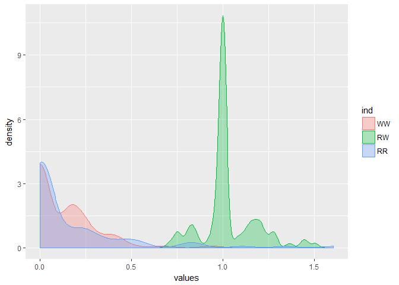
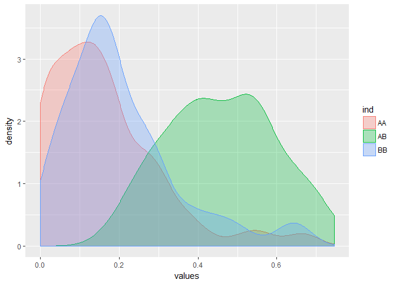
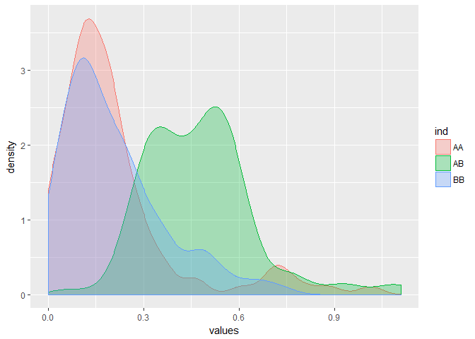
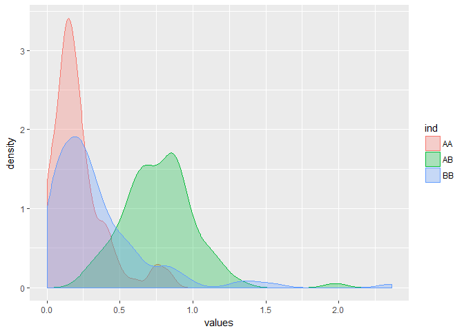

ARInfinecoefficientCalculation
================
Thiyanga Talagala
September 21, 2017

``` r
library(ggplot2)
library(forecast)
##################################
# Extract coefficients in ARIMA###
##################################

autoarimaCoef<-function(x){
  aa<<-forecast::auto.arima(x,allowdrift=F,allowmean=F,seasonal=F)
  phi<<--aa$model$phi
  theta<<-aa$model$theta
  intercept<<-aa$coef["intercept"]
  drift<<-aa$coef["drift"]
  }

#######################################
# Extract AR(infinite) coefficients####
#######################################

library(polynom)
convetARMAorARIMA<-function(ar_c=0,d=0,ma_c=0,npi=25){
  #x-backshift operator B
  #ar-non seasonal ar part
  #diff-non seasonal difference order
  #ma-non seasonal ma part
  #npi-number of pi coefficients need to calculate
  p<-length(ar_c)
  ar=-1*ar_c
  ar<-polynomial(c(1,ar))
  backshift_nonseasonal<-polynomial(c(1,-1))
  diff<-backshift_nonseasonal^d
  LHS_poly<-ar*diff
  LHS_coef<-coef(LHS_poly)#extract the coefficients of RHS_poly
  if(length(LHS_coef)==1){LHS_coef=rep(0,npi+1)}
  LHS_B_coef<-LHS_coef[-1]#extract the B coefficients of RHS and store it into a matrix
  LHS_B_coef_length=length( LHS_B_coef)
  if(LHS_B_coef_length!=npi){
    zero_mat1<- matrix( rep(0,npi),nrow=npi, ncol=1)
    for (i in 1:LHS_B_coef_length){
      zero_mat1[i,1]<-LHS_B_coef[i]
      i=i+1
    }
    LHS1<-zero_mat1
  }else {LHS1<-as.matrix(LHS_B_coef)}
  length_ma_c=length(ma_c)
  
  if(length_ma_c!=npi){
    zero_mat2 <- matrix( rep(0,npi),nrow=npi, ncol=1)
    for (i in 1:length_ma_c){
      zero_mat2[i,1]<-ma_c[i]
      i=i+1
    }
    RHS1<-zero_mat2
  }else {RHS1<-as.matrix(ma_c)}
  #Coefficient matrix
  con_mat=RHS1+LHS1
  #pi coefficient mat
  pi<-diag(-1,npi,npi)
  k=2
  for (i in 1: length_ma_c){
    for(j in k:npi){
      pi[j,j-i]<-ma_c[i]
    }
    k=k+1
  }
  #values of pi coefficients
  solve(pi)%*%con_mat
}


##################################################################
# values of drift, intercept, and pi coeficient into a one vector#
##################################################################

DrInPi<-function(x){
  autoarimaCoef(x)
  #vector of drift values
  driftV=c()
  if (is.na(drift)){driftV=0}
  else {driftV=drift}
  
  
  # vector of drift values
  interceptV=c()
  if (is.na(intercept)){interceptV=0}
  else {interceptV=intercept}
 
  
  phiV=c()# vector of phi values
  if (length(phi)==0){phiV[1]=0}
  else {phiV=-1*phi}
  
  thetaV=c()# vector of phi values
  if (length(theta)==0){thetaV[1]=0}
  else {thetaV=-1*theta}
  
  #order of non seasonal difference
  deltaV=c()
  del<-aa$model$Delta[1]
  if (is.na(del)){deltaV[1]=0}
  else {deltaV=del[1]}
  
  d<-deltaV[1]
  
  
  ArInf<-convetARMAorARIMA(ar_c=phiV,d=d,ma_c=thetaV,npi=25)
  ArInf<<-as.vector(ArInf)
  
  DriftInterceptCoef<-c(driftV,interceptV,ArInf)
  DriftInterceptCoef
  
}


#################################################################
#Distance between two time series models ########################
#################################################################

Dist<-function(x,y){
  distX<-DrInPi(x)
  distY<-DrInPi(y)
  
  sqrt(sum((distX-distY)^2))
}

#####################
#Simulation results##
#####################

###################################
# 1. random walk vs White noise   #
###################################


dist_calrw=function(n){ # n - number of simulations 
  
  RR<<-rep(NA,n)
  RW<<-rep(NA,n)
  WW<<-rep(NA,n)
  
  for (i in 1:n){
    
    w1<-rnorm(100,0,1)# white noise series - 1(length 100)
    w2<-rnorm(120,0,1)# white noise series - 2(length 120)
    
    r1<-cumsum(rnorm(80,0,1))# random walk series - 1(length 80)
    r2 <- cumsum(rnorm(110,0,1))# random walk series - 2(length 110)
    
    
    
    #-----------------------------------------------------------------------------
  
      WW[i] <-Dist(w1,w2)
      RW[i] <-Dist(w1,r1)
      RR[i] <-Dist(r1,r2)
      
      }
  
  d<<- data.frame(WW,RW,RR)
  
}


dist_calrw(100)
dfs <- stack(d)
ggplot(dfs, aes(x=values)) + geom_density(aes(group=ind, colour=ind, fill=ind), alpha=0.3)
```



``` r
######################################
# 2. AR(1) phi = 0.9 vs AR(1) phi=0.5#
######################################


dist_calAR=function(n){ # n - number of simulations 
  
  AA<<-rep(NA,n)
  AB<<-rep(NA,n)
  BB<<-rep(NA,n)
  
  for (i in 1:n){
    
    AR1_0.9<-arima.sim(list(order = c(1,0,0), ar = 0.9), n = 200)# (length 200)
    AR2_0.9<-arima.sim(list(order = c(1,0,0), ar = 0.9), n = 120)# (length 120)
    
    AR1_0.5<-arima.sim(list(order = c(1,0,0), ar = 0.5), n = 80)#(length 80)
    AR2_0.5<-arima.sim(list(order = c(1,0,0), ar = 0.5), n = 110)#(length 110)
    
 
    AA[i] <-Dist(AR1_0.9,AR2_0.9)
    AB[i] <-Dist(AR1_0.9, AR1_0.5)
    BB[i] <-Dist( AR1_0.5,AR2_0.5)
    
  }
  
  d<<- data.frame(AA,AB,BB)
  
}


dist_calAR(100)
dfs <- stack(d)
ggplot(dfs, aes(x=values)) + geom_density(aes(group=ind, colour=ind, fill=ind), alpha=0.3)
```



``` r
########################################
# 3. AR(1) phi = 0.9 vs MA(1) theta=0.5#
########################################


dist_calAM=function(n){ # n - number of simulations 
  
  AA<<-rep(NA,n)
  AB<<-rep(NA,n)
  BB<<-rep(NA,n)
  
  for (i in 1:n){
    
    AR1_0.9<-arima.sim(list(order = c(1,0,0), ar = 0.9), n = 200)# (length 200)
    AR2_0.9<-arima.sim(list(order = c(1,0,0), ar = 0.9), n = 120)# (length 120)
    
    MA1_0.5<-arima.sim(list(order = c(0,0,1), ma = 0.5), n = 80)#(length 80)
    MA2_0.5<-arima.sim(list(order = c(0,0,1), ma = 0.5), n = 110)#(length 110)
    
    
    AA[i] <-Dist(AR1_0.9,AR2_0.9)
    AB[i] <-Dist(AR1_0.9, MA1_0.5)
    BB[i] <-Dist( MA1_0.5,MA2_0.5)
    
  }
  
  d<<- data.frame(AA,AB,BB)
  
}


dist_calAR(100)
dfs <- stack(d)
ggplot(dfs, aes(x=values)) + geom_density(aes(group=ind, colour=ind, fill=ind), alpha=0.3)
```



``` r
#############################################
# 4. AR(1) phi = 0.9 vs ARIMA(1,1,0) phi=0.5#
#############################################


dist_calARIMA=function(n){ # n - number of simulations 
  
  AA<<-rep(NA,n)
  AB<<-rep(NA,n)
  BB<<-rep(NA,n)
  
  for (i in 1:n){
    
    AR1_0.9<-arima.sim(list(order = c(1,0,0), ar = 0.9), n = 200)# (length 200)
    AR2_0.9<-arima.sim(list(order = c(1,0,0), ar = 0.9), n = 120)# (length 120)
    
    AR1_0.5<-arima.sim(list(order = c(1,1,0), ar = 0.5), n = 80)#(length 80)
    AR2_0.5<-arima.sim(list(order = c(1,1,0), ar = 0.5), n = 110)#(length 110)
    
    
    AA[i] <-Dist(AR1_0.9,AR2_0.9)
    AB[i] <-Dist(AR1_0.9, AR1_0.5)
    BB[i] <-Dist( AR1_0.5,AR2_0.5)
    
  }
  
  d<<- data.frame(AA,AB,BB)
  
}


dist_calARIMA(100)
dfs <- stack(d)
ggplot(dfs, aes(x=values)) + geom_density(aes(group=ind, colour=ind, fill=ind), alpha=0.3)
```



``` r
################################
# 5. ARMA(1,1) vs ARIMA(1,1,1) #
################################

dist_calARIMA=function(n){ # n - number of simulations 
  
  AA<<-rep(NA,n)
  AB<<-rep(NA,n)
  BB<<-rep(NA,n)
  
  for (i in 1:n){
    
    AR1_0.9<-arima.sim(list(order = c(1,0,1), ar = 0.9,ma=0.2), n = 200)# (length 200)
    AR2_0.9<-arima.sim(list(order = c(1,0,1), ar = 0.9,ma=0.2), n = 120)# (length 120)
    
    AR1_0.5<-arima.sim(list(order = c(1,1,1), ar = 0.5,ma=0.2), n = 80)#(length 80)
    AR2_0.5<-arima.sim(list(order = c(1,1,1), ar = 0.5,ma=0.2), n = 110)#(length 110)
    
    
    AA[i] <-Dist(AR1_0.9,AR2_0.9)
    AB[i] <-Dist(AR1_0.9, AR1_0.5)
    BB[i] <-Dist( AR1_0.5,AR2_0.5)
    
  }
  
  d<<- data.frame(AA,AB,BB)
  
}


dist_calARIMA(100)
dfs <- stack(d)
ggplot(dfs, aes(x=values)) + geom_density(aes(group=ind, colour=ind, fill=ind), alpha=0.3)
```


