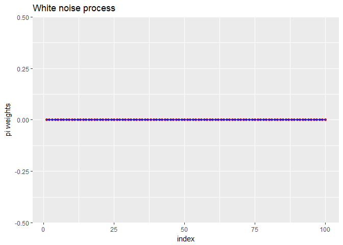

Pi Coefficient Assignment
================
Thiyanga Talagala
September 21, 2017

``` r
#pi coefficients
library(polynom)
convetARMAorARIMA<-function(ar_c=0,d=0,ma_c=0,npi=25){
#x-backshift operator B
#ar-non seasonal ar part
#diff-non seasonal difference order
#ma-non seasonal ma part
#npi-number of pi coefficients need to calculate
p<-length(ar_c)
ar=-1*ar_c
ar<-polynomial(c(1,ar))
backshift_nonseasonal<-polynomial(c(1,-1))
diff<-backshift_nonseasonal^d
LHS_poly<-ar*diff
LHS_coef<-coef(LHS_poly)#extract the coefficients of RHS_poly
if(length(LHS_coef)==1){LHS_coef=rep(0,npi+1)}
LHS_B_coef<-LHS_coef[-1]#extract the B coefficients of RHS and store it into a matrix
LHS_B_coef_length=length( LHS_B_coef)
if(LHS_B_coef_length!=npi){
zero_mat1<- matrix( rep(0,npi),nrow=npi, ncol=1)
for (i in 1:LHS_B_coef_length){
zero_mat1[i,1]<-LHS_B_coef[i]
i=i+1
}
LHS1<-zero_mat1
}else {LHS1<-as.matrix(LHS_B_coef)}
length_ma_c=length(ma_c)


if(length_ma_c!=npi){
zero_mat2 <- matrix( rep(0,npi),nrow=npi, ncol=1)
for (i in 1:length_ma_c){
zero_mat2[i,1]<-ma_c[i]
i=i+1
}
RHS1<-zero_mat2
}else {RHS1<-as.matrix(ma_c)}
#Coefficient matrix
con_mat=RHS1+LHS1
#pi coefficient mat
pi<-diag(-1,npi,npi)
k=2
for (i in 1: length_ma_c){
for(j in k:npi){
pi[j,j-i]<-ma_c[i]
}
k=k+1
}
#values of pi coefficients
solve(pi)%*%con_mat
}
```

``` r
convetARMAorARIMA(d=1,ar_c=c(-0.3),ma_c=(0.5),npi=100)
```

    ##                [,1]
    ##   [1,] 2.000000e-01
    ##   [2,] 4.000000e-01
    ##   [3,] 2.000000e-01
    ##   [4,] 1.000000e-01
    ##   [5,] 5.000000e-02
    ##   [6,] 2.500000e-02
    ##   [7,] 1.250000e-02
    ##   [8,] 6.250000e-03
    ##   [9,] 3.125000e-03
    ##  [10,] 1.562500e-03
    ##  [11,] 7.812500e-04
    ##  [12,] 3.906250e-04
    ##  [13,] 1.953125e-04
    ##  [14,] 9.765625e-05
    ##  [15,] 4.882812e-05
    ##  [16,] 2.441406e-05
    ##  [17,] 1.220703e-05
    ##  [18,] 6.103516e-06
    ##  [19,] 3.051758e-06
    ##  [20,] 1.525879e-06
    ##  [21,] 7.629395e-07
    ##  [22,] 3.814697e-07
    ##  [23,] 1.907349e-07
    ##  [24,] 9.536743e-08
    ##  [25,] 4.768372e-08
    ##  [26,] 2.384186e-08
    ##  [27,] 1.192093e-08
    ##  [28,] 5.960464e-09
    ##  [29,] 2.980232e-09
    ##  [30,] 1.490116e-09
    ##  [31,] 7.450581e-10
    ##  [32,] 3.725290e-10
    ##  [33,] 1.862645e-10
    ##  [34,] 9.313226e-11
    ##  [35,] 4.656613e-11
    ##  [36,] 2.328306e-11
    ##  [37,] 1.164153e-11
    ##  [38,] 5.820766e-12
    ##  [39,] 2.910383e-12
    ##  [40,] 1.455192e-12
    ##  [41,] 7.275958e-13
    ##  [42,] 3.637979e-13
    ##  [43,] 1.818989e-13
    ##  [44,] 9.094947e-14
    ##  [45,] 4.547474e-14
    ##  [46,] 2.273737e-14
    ##  [47,] 1.136868e-14
    ##  [48,] 5.684342e-15
    ##  [49,] 2.842171e-15
    ##  [50,] 1.421085e-15
    ##  [51,] 7.105427e-16
    ##  [52,] 3.552714e-16
    ##  [53,] 1.776357e-16
    ##  [54,] 8.881784e-17
    ##  [55,] 4.440892e-17
    ##  [56,] 2.220446e-17
    ##  [57,] 1.110223e-17
    ##  [58,] 5.551115e-18
    ##  [59,] 2.775558e-18
    ##  [60,] 1.387779e-18
    ##  [61,] 6.938894e-19
    ##  [62,] 3.469447e-19
    ##  [63,] 1.734723e-19
    ##  [64,] 8.673617e-20
    ##  [65,] 4.336809e-20
    ##  [66,] 2.168404e-20
    ##  [67,] 1.084202e-20
    ##  [68,] 5.421011e-21
    ##  [69,] 2.710505e-21
    ##  [70,] 1.355253e-21
    ##  [71,] 6.776264e-22
    ##  [72,] 3.388132e-22
    ##  [73,] 1.694066e-22
    ##  [74,] 8.470329e-23
    ##  [75,] 4.235165e-23
    ##  [76,] 2.117582e-23
    ##  [77,] 1.058791e-23
    ##  [78,] 5.293956e-24
    ##  [79,] 2.646978e-24
    ##  [80,] 1.323489e-24
    ##  [81,] 6.617445e-25
    ##  [82,] 3.308722e-25
    ##  [83,] 1.654361e-25
    ##  [84,] 8.271806e-26
    ##  [85,] 4.135903e-26
    ##  [86,] 2.067952e-26
    ##  [87,] 1.033976e-26
    ##  [88,] 5.169879e-27
    ##  [89,] 2.584939e-27
    ##  [90,] 1.292470e-27
    ##  [91,] 6.462349e-28
    ##  [92,] 3.231174e-28
    ##  [93,] 1.615587e-28
    ##  [94,] 8.077936e-29
    ##  [95,] 4.038968e-29
    ##  [96,] 2.019484e-29
    ##  [97,] 1.009742e-29
    ##  [98,] 5.048710e-30
    ##  [99,] 2.524355e-30
    ## [100,] 1.262177e-30

``` r
library(ggplot2)
pi1<-convetARMAorARIMA(d=1,ar_c=c(-0.3),ma_c=(0.5),npi=100)
index<-1:100
dfr1<-data.frame(pi1,index)
ggplot(dfr1,aes(index,pi1))+geom_point(color="firebrick")+geom_line(color="blue")+
labs(y= "pi weights")+
labs(title="Plot of pi weights for ARIMA(1,1,1) with phi=-0.3, theta = 0.5")
```


``` r
convetARMAorARIMA(d=1,ar_c=c(0),ma_c=(0.7),npi=100)
```

    ##                [,1]
    ##   [1,] 3.000000e-01
    ##   [2,] 2.100000e-01
    ##   [3,] 1.470000e-01
    ##   [4,] 1.029000e-01
    ##   [5,] 7.203000e-02
    ##   [6,] 5.042100e-02
    ##   [7,] 3.529470e-02
    ##   [8,] 2.470629e-02
    ##   [9,] 1.729440e-02
    ##  [10,] 1.210608e-02
    ##  [11,] 8.474257e-03
    ##  [12,] 5.931980e-03
    ##  [13,] 4.152386e-03
    ##  [14,] 2.906670e-03
    ##  [15,] 2.034669e-03
    ##  [16,] 1.424268e-03
    ##  [17,] 9.969879e-04
    ##  [18,] 6.978915e-04
    ##  [19,] 4.885241e-04
    ##  [20,] 3.419669e-04
    ##  [21,] 2.393768e-04
    ##  [22,] 1.675638e-04
    ##  [23,] 1.172946e-04
    ##  [24,] 8.210624e-05
    ##  [25,] 5.747437e-05
    ##  [26,] 4.023206e-05
    ##  [27,] 2.816244e-05
    ##  [28,] 1.971371e-05
    ##  [29,] 1.379960e-05
    ##  [30,] 9.659717e-06
    ##  [31,] 6.761802e-06
    ##  [32,] 4.733261e-06
    ##  [33,] 3.313283e-06
    ##  [34,] 2.319298e-06
    ##  [35,] 1.623509e-06
    ##  [36,] 1.136456e-06
    ##  [37,] 7.955193e-07
    ##  [38,] 5.568635e-07
    ##  [39,] 3.898044e-07
    ##  [40,] 2.728631e-07
    ##  [41,] 1.910042e-07
    ##  [42,] 1.337029e-07
    ##  [43,] 9.359204e-08
    ##  [44,] 6.551443e-08
    ##  [45,] 4.586010e-08
    ##  [46,] 3.210207e-08
    ##  [47,] 2.247145e-08
    ##  [48,] 1.573001e-08
    ##  [49,] 1.101101e-08
    ##  [50,] 7.707707e-09
    ##  [51,] 5.395395e-09
    ##  [52,] 3.776777e-09
    ##  [53,] 2.643744e-09
    ##  [54,] 1.850621e-09
    ##  [55,] 1.295434e-09
    ##  [56,] 9.068041e-10
    ##  [57,] 6.347628e-10
    ##  [58,] 4.443340e-10
    ##  [59,] 3.110338e-10
    ##  [60,] 2.177237e-10
    ##  [61,] 1.524066e-10
    ##  [62,] 1.066846e-10
    ##  [63,] 7.467921e-11
    ##  [64,] 5.227545e-11
    ##  [65,] 3.659281e-11
    ##  [66,] 2.561497e-11
    ##  [67,] 1.793048e-11
    ##  [68,] 1.255134e-11
    ##  [69,] 8.785935e-12
    ##  [70,] 6.150154e-12
    ##  [71,] 4.305108e-12
    ##  [72,] 3.013576e-12
    ##  [73,] 2.109503e-12
    ##  [74,] 1.476652e-12
    ##  [75,] 1.033656e-12
    ##  [76,] 7.235595e-13
    ##  [77,] 5.064917e-13
    ##  [78,] 3.545442e-13
    ##  [79,] 2.481809e-13
    ##  [80,] 1.737266e-13
    ##  [81,] 1.216086e-13
    ##  [82,] 8.512605e-14
    ##  [83,] 5.958824e-14
    ##  [84,] 4.171177e-14
    ##  [85,] 2.919824e-14
    ##  [86,] 2.043877e-14
    ##  [87,] 1.430714e-14
    ##  [88,] 1.001499e-14
    ##  [89,] 7.010496e-15
    ##  [90,] 4.907348e-15
    ##  [91,] 3.435143e-15
    ##  [92,] 2.404600e-15
    ##  [93,] 1.683220e-15
    ##  [94,] 1.178254e-15
    ##  [95,] 8.247779e-16
    ##  [96,] 5.773445e-16
    ##  [97,] 4.041412e-16
    ##  [98,] 2.828988e-16
    ##  [99,] 1.980292e-16
    ## [100,] 1.386204e-16

``` r
pi1<-convetARMAorARIMA(d=1,ar_c=c(0),ma_c=(0.7),npi=100)
index<-1:100
dfr1<-data.frame(pi1,index)
ggplot(dfr1,aes(index,pi1))+geom_point(color="firebrick")+geom_line(color="blue")+
labs(y="pi weights")+labs(title="Plot of pi weights for ARIMA(0,1,1) with psi=0, theta = 0.7")
```


``` r
convetARMAorARIMA(d=1,ar_c=c(0.5,0.2),ma_c=(0.5),npi=100)
```

    ##                 [,1]
    ##   [1,]  1.000000e+00
    ##   [2,]  2.000000e-01
    ##   [3,] -1.000000e-01
    ##   [4,] -5.000000e-02
    ##   [5,] -2.500000e-02
    ##   [6,] -1.250000e-02
    ##   [7,] -6.250000e-03
    ##   [8,] -3.125000e-03
    ##   [9,] -1.562500e-03
    ##  [10,] -7.812500e-04
    ##  [11,] -3.906250e-04
    ##  [12,] -1.953125e-04
    ##  [13,] -9.765625e-05
    ##  [14,] -4.882813e-05
    ##  [15,] -2.441406e-05
    ##  [16,] -1.220703e-05
    ##  [17,] -6.103516e-06
    ##  [18,] -3.051758e-06
    ##  [19,] -1.525879e-06
    ##  [20,] -7.629395e-07
    ##  [21,] -3.814697e-07
    ##  [22,] -1.907349e-07
    ##  [23,] -9.536743e-08
    ##  [24,] -4.768372e-08
    ##  [25,] -2.384186e-08
    ##  [26,] -1.192093e-08
    ##  [27,] -5.960464e-09
    ##  [28,] -2.980232e-09
    ##  [29,] -1.490116e-09
    ##  [30,] -7.450581e-10
    ##  [31,] -3.725290e-10
    ##  [32,] -1.862645e-10
    ##  [33,] -9.313226e-11
    ##  [34,] -4.656613e-11
    ##  [35,] -2.328306e-11
    ##  [36,] -1.164153e-11
    ##  [37,] -5.820766e-12
    ##  [38,] -2.910383e-12
    ##  [39,] -1.455192e-12
    ##  [40,] -7.275958e-13
    ##  [41,] -3.637979e-13
    ##  [42,] -1.818989e-13
    ##  [43,] -9.094947e-14
    ##  [44,] -4.547474e-14
    ##  [45,] -2.273737e-14
    ##  [46,] -1.136868e-14
    ##  [47,] -5.684342e-15
    ##  [48,] -2.842171e-15
    ##  [49,] -1.421085e-15
    ##  [50,] -7.105427e-16
    ##  [51,] -3.552714e-16
    ##  [52,] -1.776357e-16
    ##  [53,] -8.881784e-17
    ##  [54,] -4.440892e-17
    ##  [55,] -2.220446e-17
    ##  [56,] -1.110223e-17
    ##  [57,] -5.551115e-18
    ##  [58,] -2.775558e-18
    ##  [59,] -1.387779e-18
    ##  [60,] -6.938894e-19
    ##  [61,] -3.469447e-19
    ##  [62,] -1.734723e-19
    ##  [63,] -8.673617e-20
    ##  [64,] -4.336809e-20
    ##  [65,] -2.168404e-20
    ##  [66,] -1.084202e-20
    ##  [67,] -5.421011e-21
    ##  [68,] -2.710505e-21
    ##  [69,] -1.355253e-21
    ##  [70,] -6.776264e-22
    ##  [71,] -3.388132e-22
    ##  [72,] -1.694066e-22
    ##  [73,] -8.470329e-23
    ##  [74,] -4.235165e-23
    ##  [75,] -2.117582e-23
    ##  [76,] -1.058791e-23
    ##  [77,] -5.293956e-24
    ##  [78,] -2.646978e-24
    ##  [79,] -1.323489e-24
    ##  [80,] -6.617445e-25
    ##  [81,] -3.308722e-25
    ##  [82,] -1.654361e-25
    ##  [83,] -8.271806e-26
    ##  [84,] -4.135903e-26
    ##  [85,] -2.067952e-26
    ##  [86,] -1.033976e-26
    ##  [87,] -5.169879e-27
    ##  [88,] -2.584939e-27
    ##  [89,] -1.292470e-27
    ##  [90,] -6.462349e-28
    ##  [91,] -3.231174e-28
    ##  [92,] -1.615587e-28
    ##  [93,] -8.077936e-29
    ##  [94,] -4.038968e-29
    ##  [95,] -2.019484e-29
    ##  [96,] -1.009742e-29
    ##  [97,] -5.048710e-30
    ##  [98,] -2.524355e-30
    ##  [99,] -1.262177e-30
    ## [100,] -6.310887e-31

``` r
pi1<-convetARMAorARIMA(d=1,ar_c=c(0.5,0.2),ma_c=(0.5),npi=100)
index<-1:100
dfr1<-data.frame(pi1,index)
ggplot(dfr1,aes(index,pi1))+geom_point(color="firebrick")+geom_line(color="blue")+
labs(y="pi weights")+
labs(title="Plot of pi weights for ARIMA(2,1,1) with phi_1=0.5, phi_2=0.2 and theta=0.5
")
```


``` r
convetARMAorARIMA(d=0,ar_c=c(0),ma_c=c(0.7,0.5),npi=100)
```

    ##                 [,1]
    ##   [1,] -7.000000e-01
    ##   [2,] -9.900000e-01
    ##   [3,] -1.043000e+00
    ##   [4,] -1.225100e+00
    ##   [5,] -1.379070e+00
    ##   [6,] -1.577899e+00
    ##   [7,] -1.794064e+00
    ##   [8,] -2.044795e+00
    ##   [9,] -2.328388e+00
    ##  [10,] -2.652269e+00
    ##  [11,] -3.020783e+00
    ##  [12,] -3.440682e+00
    ##  [13,] -3.918869e+00
    ##  [14,] -4.463549e+00
    ##  [15,] -5.083919e+00
    ##  [16,] -5.790518e+00
    ##  [17,] -6.595322e+00
    ##  [18,] -7.511984e+00
    ##  [19,] -8.556050e+00
    ##  [20,] -9.745227e+00
    ##  [21,] -1.109968e+01
    ##  [22,] -1.264239e+01
    ##  [23,] -1.439952e+01
    ##  [24,] -1.640086e+01
    ##  [25,] -1.868036e+01
    ##  [26,] -2.127668e+01
    ##  [27,] -2.423386e+01
    ##  [28,] -2.760204e+01
    ##  [29,] -3.143836e+01
    ##  [30,] -3.580787e+01
    ##  [31,] -4.078469e+01
    ##  [32,] -4.645321e+01
    ##  [33,] -5.290959e+01
    ##  [34,] -6.026332e+01
    ##  [35,] -6.863912e+01
    ##  [36,] -7.817905e+01
    ##  [37,] -8.904489e+01
    ##  [38,] -1.014209e+02
    ##  [39,] -1.155171e+02
    ##  [40,] -1.315725e+02
    ##  [41,] -1.498593e+02
    ##  [42,] -1.706877e+02
    ##  [43,] -1.944110e+02
    ##  [44,] -2.214316e+02
    ##  [45,] -2.522076e+02
    ##  [46,] -2.872611e+02
    ##  [47,] -3.271866e+02
    ##  [48,] -3.726612e+02
    ##  [49,] -4.244561e+02
    ##  [50,] -4.834499e+02
    ##  [51,] -5.506430e+02
    ##  [52,] -6.271750e+02
    ##  [53,] -7.143440e+02
    ##  [54,] -8.136283e+02
    ##  [55,] -9.267118e+02
    ##  [56,] -1.055512e+03
    ##  [57,] -1.202215e+03
    ##  [58,] -1.369306e+03
    ##  [59,] -1.559622e+03
    ##  [60,] -1.776389e+03
    ##  [61,] -2.023283e+03
    ##  [62,] -2.304492e+03
    ##  [63,] -2.624786e+03
    ##  [64,] -2.989596e+03
    ##  [65,] -3.405110e+03
    ##  [66,] -3.878376e+03
    ##  [67,] -4.417418e+03
    ##  [68,] -5.031380e+03
    ##  [69,] -5.730675e+03
    ##  [70,] -6.527163e+03
    ##  [71,] -7.434352e+03
    ##  [72,] -8.467628e+03
    ##  [73,] -9.644515e+03
    ##  [74,] -1.098497e+04
    ##  [75,] -1.251174e+04
    ##  [76,] -1.425071e+04
    ##  [77,] -1.623136e+04
    ##  [78,] -1.848731e+04
    ##  [79,] -2.105680e+04
    ##  [80,] -2.398341e+04
    ##  [81,] -2.731679e+04
    ##  [82,] -3.111346e+04
    ##  [83,] -3.543781e+04
    ##  [84,] -4.036320e+04
    ##  [85,] -4.597314e+04
    ##  [86,] -5.236280e+04
    ##  [87,] -5.964053e+04
    ##  [88,] -6.792977e+04
    ##  [89,] -7.737111e+04
    ##  [90,] -8.812466e+04
    ##  [91,] -1.003728e+05
    ##  [92,] -1.143233e+05
    ##  [93,] -1.302127e+05
    ##  [94,] -1.483106e+05
    ##  [95,] -1.689237e+05
    ##  [96,] -1.924019e+05
    ##  [97,] -2.191432e+05
    ##  [98,] -2.496012e+05
    ##  [99,] -2.842924e+05
    ## [100,] -3.238053e+05

``` r
pi1<-convetARMAorARIMA(d=0,ar_c=c(0),ma_c=c(0.7,0.5),npi=100)
index<-1:100
dfr1<-data.frame(pi1,index)
ggplot(dfr1,aes(index,pi1))+geom_point(color="firebrick")+geom_line(color="blue")+
labs(y="pi weights") +
labs(title="Plot of pi weights for ARIMA(0,0,2) process with theta1=0.7 and theta2=0.5
")
```


``` r
polynomial(c(1,-0.7,-0.5))
```

    ## 1 - 0.7*x - 0.5*x^2

``` r
polyroot(c(1,-0.7,-0.5))
```

    ## [1]  0.8779734-0i -2.2779734+0i

``` r
convetARMAorARIMA(d=0,ar_c=c(0),ma_c=c(0.1,0.5),npi=100)
```

    ##                 [,1]
    ##   [1,] -1.000000e-01
    ##   [2,] -5.100000e-01
    ##   [3,] -1.010000e-01
    ##   [4,] -2.651000e-01
    ##   [5,] -7.701000e-02
    ##   [6,] -1.402510e-01
    ##   [7,] -5.253010e-02
    ##   [8,] -7.537851e-02
    ##   [9,] -3.380290e-02
    ##  [10,] -4.106955e-02
    ##  [11,] -2.100841e-02
    ##  [12,] -2.263561e-02
    ##  [13,] -1.276776e-02
    ##  [14,] -1.259458e-02
    ##  [15,] -7.643340e-03
    ##  [16,] -7.061625e-03
    ##  [17,] -4.527833e-03
    ##  [18,] -3.983596e-03
    ##  [19,] -2.662276e-03
    ##  [20,] -2.258026e-03
    ##  [21,] -1.556941e-03
    ##  [22,] -1.284707e-03
    ##  [23,] -9.069409e-04
    ##  [24,] -7.330475e-04
    ##  [25,] -5.267752e-04
    ##  [26,] -4.192013e-04
    ##  [27,] -3.053077e-04
    ##  [28,] -2.401314e-04
    ##  [29,] -1.766670e-04
    ##  [30,] -1.377324e-04
    ##  [31,] -1.021067e-04
    ##  [32,] -7.907688e-05
    ##  [33,] -5.896106e-05
    ##  [34,] -4.543455e-05
    ##  [35,] -3.402399e-05
    ##  [36,] -2.611967e-05
    ##  [37,] -1.962396e-05
    ##  [38,] -1.502223e-05
    ##  [39,] -1.131420e-05
    ##  [40,] -8.642536e-06
    ##  [41,] -6.521355e-06
    ##  [42,] -4.973404e-06
    ##  [43,] -3.758018e-06
    ##  [44,] -2.862504e-06
    ##  [45,] -2.165259e-06
    ##  [46,] -1.647778e-06
    ##  [47,] -1.247407e-06
    ##  [48,] -9.486296e-07
    ##  [49,] -7.185667e-07
    ##  [50,] -5.461715e-07
    ##  [51,] -4.139005e-07
    ##  [52,] -3.144758e-07
    ##  [53,] -2.383978e-07
    ##  [54,] -1.810777e-07
    ##  [55,] -1.373067e-07
    ##  [56,] -1.042695e-07
    ##  [57,] -7.908029e-08
    ##  [58,] -6.004278e-08
    ##  [59,] -4.554442e-08
    ##  [60,] -3.457583e-08
    ##  [61,] -2.622979e-08
    ##  [62,] -1.991090e-08
    ##  [63,] -1.510599e-08
    ##  [64,] -1.146605e-08
    ##  [65,] -8.699598e-09
    ##  [66,] -6.602983e-09
    ##  [67,] -5.010097e-09
    ##  [68,] -3.802501e-09
    ##  [69,] -2.885299e-09
    ##  [70,] -2.189781e-09
    ##  [71,] -1.661627e-09
    ##  [72,] -1.261053e-09
    ##  [73,] -9.569190e-10
    ##  [74,] -7.262184e-10
    ##  [75,] -5.510814e-10
    ##  [76,] -4.182173e-10
    ##  [77,] -3.173624e-10
    ##  [78,] -2.408449e-10
    ##  [79,] -1.827657e-10
    ##  [80,] -1.386990e-10
    ##  [81,] -1.052528e-10
    ##  [82,] -7.987479e-11
    ##  [83,] -6.061385e-11
    ##  [84,] -4.599878e-11
    ##  [85,] -3.490681e-11
    ##  [86,] -2.649007e-11
    ##  [87,] -2.010241e-11
    ##  [88,] -1.525528e-11
    ##  [89,] -1.157673e-11
    ##  [90,] -8.785311e-12
    ##  [91,] -6.666897e-12
    ##  [92,] -5.059345e-12
    ##  [93,] -3.839383e-12
    ##  [94,] -2.913611e-12
    ##  [95,] -2.211053e-12
    ##  [96,] -1.677911e-12
    ##  [97,] -1.273317e-12
    ##  [98,] -9.662871e-13
    ##  [99,] -7.332874e-13
    ## [100,] -5.564723e-13

``` r
pi1<-convetARMAorARIMA(d=0,ar_c=c(0),ma_c=c(0.1,0.5),npi=100)
index<-1:100
dfr1<-data.frame(pi1,index)
ggplot(dfr1,aes(index,pi1))+geom_point(color="firebrick")+geom_line(color="blue")+
labs(y="pi weights")+
labs(title="Plot of pi weights for ARIMA(0,0,2) process with theta1=0.1 and theta2=0.5 ")
```


``` r
polynomial(c(1,-0.1,-0.5))
```

    ## 1 - 0.1*x - 0.5*x^2

``` r
polyroot(c(1,-0.1,-0.5))
```

    ## [1]  1.317745+0i -1.517745+0i

Random walk model
=================

``` r
convetARMAorARIMA(d=1,ar_c=c(0),ma_c=c(0),npi=100)
```

    ##        [,1]
    ##   [1,]    1
    ##   [2,]    0
    ##   [3,]    0
    ##   [4,]    0
    ##   [5,]    0
    ##   [6,]    0
    ##   [7,]    0
    ##   [8,]    0
    ##   [9,]    0
    ##  [10,]    0
    ##  [11,]    0
    ##  [12,]    0
    ##  [13,]    0
    ##  [14,]    0
    ##  [15,]    0
    ##  [16,]    0
    ##  [17,]    0
    ##  [18,]    0
    ##  [19,]    0
    ##  [20,]    0
    ##  [21,]    0
    ##  [22,]    0
    ##  [23,]    0
    ##  [24,]    0
    ##  [25,]    0
    ##  [26,]    0
    ##  [27,]    0
    ##  [28,]    0
    ##  [29,]    0
    ##  [30,]    0
    ##  [31,]    0
    ##  [32,]    0
    ##  [33,]    0
    ##  [34,]    0
    ##  [35,]    0
    ##  [36,]    0
    ##  [37,]    0
    ##  [38,]    0
    ##  [39,]    0
    ##  [40,]    0
    ##  [41,]    0
    ##  [42,]    0
    ##  [43,]    0
    ##  [44,]    0
    ##  [45,]    0
    ##  [46,]    0
    ##  [47,]    0
    ##  [48,]    0
    ##  [49,]    0
    ##  [50,]    0
    ##  [51,]    0
    ##  [52,]    0
    ##  [53,]    0
    ##  [54,]    0
    ##  [55,]    0
    ##  [56,]    0
    ##  [57,]    0
    ##  [58,]    0
    ##  [59,]    0
    ##  [60,]    0
    ##  [61,]    0
    ##  [62,]    0
    ##  [63,]    0
    ##  [64,]    0
    ##  [65,]    0
    ##  [66,]    0
    ##  [67,]    0
    ##  [68,]    0
    ##  [69,]    0
    ##  [70,]    0
    ##  [71,]    0
    ##  [72,]    0
    ##  [73,]    0
    ##  [74,]    0
    ##  [75,]    0
    ##  [76,]    0
    ##  [77,]    0
    ##  [78,]    0
    ##  [79,]    0
    ##  [80,]    0
    ##  [81,]    0
    ##  [82,]    0
    ##  [83,]    0
    ##  [84,]    0
    ##  [85,]    0
    ##  [86,]    0
    ##  [87,]    0
    ##  [88,]    0
    ##  [89,]    0
    ##  [90,]    0
    ##  [91,]    0
    ##  [92,]    0
    ##  [93,]    0
    ##  [94,]    0
    ##  [95,]    0
    ##  [96,]    0
    ##  [97,]    0
    ##  [98,]    0
    ##  [99,]    0
    ## [100,]    0

``` r
pi1<-convetARMAorARIMA(d=1,ar_c=c(0),ma_c=c(0),npi=100)
index<-1:100
dfr1<-data.frame(pi1,index)
ggplot(dfr1,aes(index,pi1))+geom_point(color="firebrick")+geom_line(color="blue")+
labs(y="pi weights")+labs(title="Plot of pi weights of random walk model")
```


White noise process
===================

``` r
convetARMAorARIMA(d=0,ar_c=c(0),ma_c=c(0),npi=100)
```

    ##        [,1]
    ##   [1,]    0
    ##   [2,]    0
    ##   [3,]    0
    ##   [4,]    0
    ##   [5,]    0
    ##   [6,]    0
    ##   [7,]    0
    ##   [8,]    0
    ##   [9,]    0
    ##  [10,]    0
    ##  [11,]    0
    ##  [12,]    0
    ##  [13,]    0
    ##  [14,]    0
    ##  [15,]    0
    ##  [16,]    0
    ##  [17,]    0
    ##  [18,]    0
    ##  [19,]    0
    ##  [20,]    0
    ##  [21,]    0
    ##  [22,]    0
    ##  [23,]    0
    ##  [24,]    0
    ##  [25,]    0
    ##  [26,]    0
    ##  [27,]    0
    ##  [28,]    0
    ##  [29,]    0
    ##  [30,]    0
    ##  [31,]    0
    ##  [32,]    0
    ##  [33,]    0
    ##  [34,]    0
    ##  [35,]    0
    ##  [36,]    0
    ##  [37,]    0
    ##  [38,]    0
    ##  [39,]    0
    ##  [40,]    0
    ##  [41,]    0
    ##  [42,]    0
    ##  [43,]    0
    ##  [44,]    0
    ##  [45,]    0
    ##  [46,]    0
    ##  [47,]    0
    ##  [48,]    0
    ##  [49,]    0
    ##  [50,]    0
    ##  [51,]    0
    ##  [52,]    0
    ##  [53,]    0
    ##  [54,]    0
    ##  [55,]    0
    ##  [56,]    0
    ##  [57,]    0
    ##  [58,]    0
    ##  [59,]    0
    ##  [60,]    0
    ##  [61,]    0
    ##  [62,]    0
    ##  [63,]    0
    ##  [64,]    0
    ##  [65,]    0
    ##  [66,]    0
    ##  [67,]    0
    ##  [68,]    0
    ##  [69,]    0
    ##  [70,]    0
    ##  [71,]    0
    ##  [72,]    0
    ##  [73,]    0
    ##  [74,]    0
    ##  [75,]    0
    ##  [76,]    0
    ##  [77,]    0
    ##  [78,]    0
    ##  [79,]    0
    ##  [80,]    0
    ##  [81,]    0
    ##  [82,]    0
    ##  [83,]    0
    ##  [84,]    0
    ##  [85,]    0
    ##  [86,]    0
    ##  [87,]    0
    ##  [88,]    0
    ##  [89,]    0
    ##  [90,]    0
    ##  [91,]    0
    ##  [92,]    0
    ##  [93,]    0
    ##  [94,]    0
    ##  [95,]    0
    ##  [96,]    0
    ##  [97,]    0
    ##  [98,]    0
    ##  [99,]    0
    ## [100,]    0

``` r
library(ggplot2)
pi1<-convetARMAorARIMA(d=0,ar_c=c(0),ma_c=c(0),npi=100)
index<-1:100
dfr1<-data.frame(pi1,index)
ggplot(dfr1,aes(index,pi1))+geom_point(color="firebrick")+geom_line(color="blue")+
labs(y="pi weights")+labs(title="White noise process")
```



ARIMA(1,0,0)
============

``` r
pi1<-convetARMAorARIMA(d=0,ar_c=c(-0.9),ma_c=c(0),npi=100)
pi2<-convetARMAorARIMA(d=0,ar_c=c(-0.5),ma_c=c(0),npi=100)
pi3<-convetARMAorARIMA(d=0,ar_c=c(0.5),ma_c=c(0),npi=100)
pi4<-convetARMAorARIMA(d=0,ar_c=c(0.9),ma_c=c(0),npi=100)
index<-1:100
dfr1<-data.frame(pi1,pi2,pi3,pi4,index)
ggplot(dfr1,aes(index,y))+
geom_point(aes(y=pi1,color="-0.9"))+geom_line(aes(y=pi1,color="-0.9"))+
geom_point(aes(y=pi2,color="-0.5"))+geom_line(aes(y=pi2,color="-0.5"))+
geom_point(aes(y=pi3,color="0.5"))+geom_line(aes(y=pi3,color="0.5"))+
geom_point(aes(y=pi4,color="0.9"))+geom_line(aes(y=pi4,color="0.9"))+
labs(y="pi weights")+labs(title="Plot of pi weights of ARIMA(1,0,0) " ,color = "AR(1) coefficient\n")
```


ARIMA(1,1,0)
============

``` r
pi2<-convetARMAorARIMA(d=1,ar_c=c(-0.5),ma_c=c(0),npi=100)
pi3<-convetARMAorARIMA(d=1,ar_c=c(0.5),ma_c=c(0),npi=100)
pi4<-convetARMAorARIMA(d=1,ar_c=c(0.9),ma_c=c(0),npi=100)
index<-1:100
dfr1<-data.frame(pi1,pi2,pi3,pi4,index)
ggplot(dfr1,aes(index,y))+
geom_point(aes(y=pi1,color="-0.9"))+geom_line(aes(y=pi1,color="-0.9"))+
geom_point(aes(y=pi2,color="-0.5"))+geom_line(aes(y=pi2,color="-0.5"))+
geom_point(aes(y=pi3,color="0.5"))+geom_line(aes(y=pi3,color="0.5"))+
geom_point(aes(y=pi4,color="0.9"))+geom_line(aes(y=pi4,color="0.9"))+
labs(y="pi weights")+labs(title="Plot of pi weights of ARIMA(1,1,0)
",color = "AR(1) coefficient\n")
```


ARIMA(1,1,1)
============

``` r
pi1<-convetARMAorARIMA(d=1,ar_c=c(-0.9),ma_c=c(0.1),npi=100)
pi2<-convetARMAorARIMA(d=1,ar_c=c(-0.5),ma_c=c(0.1),npi=100)
pi3<-convetARMAorARIMA(d=1,ar_c=c(0.5),ma_c=c(0.1),npi=100)
pi4<-convetARMAorARIMA(d=1,ar_c=c(0.9),ma_c=c(0.1),npi=100)
index<-1:100
dfr1<-data.frame(pi1,pi2,pi3,pi4,index)
ggplot(dfr1,aes(index,y))+
geom_point(aes(y=pi1,color="-0.9"))+geom_line(aes(y=pi1,color="-0.9"))+
geom_point(aes(y=pi2,color="-0.5"))+geom_line(aes(y=pi2,color="-0.5"))+
geom_point(aes(y=pi3,color="0.5"))+geom_line(aes(y=pi3,color="0.5"))+
geom_point(aes(y=pi4,color="0.9"))+geom_line(aes(y=pi4,color="0.9"))+
labs(y="pi weights")+labs(title="Plot of pi weights of ARIMA(1,1,1) ", color = "phi coefficient\n")
```


ARIMA(0,1,1)
============
