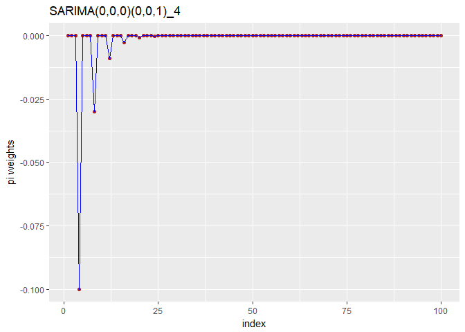
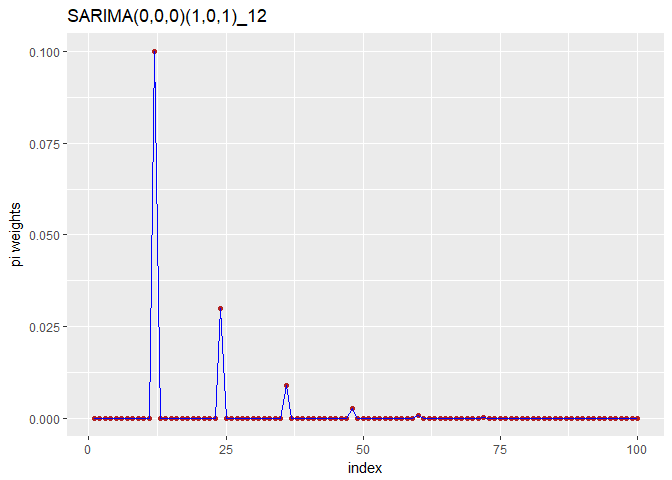
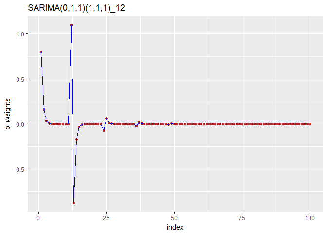

SARIMA pi coefficients
================
Thiyanga Talagala
September 21, 2017

``` r
library(polynom)
library(ggplot2)
#warning-npi should be geater than or equal to s
convet_SARMA_or_S_ARIMA<-function(ar_c=0,d=0,ma_c=0,sar_c=0,D=0,sma_c=0,s=12,npi=25){
#seasonality, 12-monthly, 4-quartely, 7-weekly, etc.
#x-backshift operator B
#ar-non seasonal ar part
#diff-non seasonal difference order
#ma-non seasonal ma part
#sar-seasonal ar part
#sdiff-seasonal difference order
#sma-seasonal ma part
  
#npi-number of pi coefficients need to calculate
p<-length(ar_c)
ar=-1*ar_c
#ma=-1*ma_c
#non-seasonal part
ar<-polynomial(c(1,ar))
backshift_nonseasonal<-polynomial(c(1,-1))
diff<-backshift_nonseasonal^d
#seasonal part
a=length(sar_c)
b=s*a
seasonal_poly=rep(0,b)
for(i in 1:a){
seasonal_position=s*i
seasonal_poly[seasonal_position]=sar_c[i]
}
sar=-1*seasonal_poly
sar<-polynomial(c(1,sar))
sbackshift_seasonal<-polynomial(c(1,rep(0,s-1),-1))
sdiff<-sbackshift_seasonal^D
if(ar_c!=0){ar=ar} else {ar=1}
LHS_poly<-ar*sar*diff*sdiff
LHS_coef<-coef(LHS_poly)#extract the coefficients of RHS_poly
if(length(LHS_coef)==1){LHS_coef=rep(0,npi+1)}
LHS_B_coef<-LHS_coef[-1]#extract the B coefficients of RHS and store it into a matrix
LHS_B_coef_length=length( LHS_B_coef)
if(LHS_B_coef_length!=npi){
zero_mat1<- matrix( rep(0,npi),nrow=npi, ncol=1)
for (i in 1:LHS_B_coef_length){
zero_mat1[i,1]<-LHS_B_coef[i]
i=i+1
}
LHS1<-zero_mat1
} else {LHS1<-as.matrix(LHS_B_coef)}
length_ma_c=length(ma_c)
initial_pi1<-c(rep(0,npi))
if (length_ma_c<npi){
  for (i in 1:length_ma_c){
initial_pi1[i]<-ma_c[i]
} }else {
for (i in 1:npi){
initial_pi1[i]<-ma_c[i]
}
}
# Number of times that the seasonal component should be repeat
n_times_repeat_seasonal=npi%/%s
# add s_theta to corresponding positions
for(i in 1:n_times_repeat_seasonal){
if(is.na(sma_c[i])==0){
seasonal<-i*s
initial_pi1[seasonal]<-initial_pi1[seasonal]+sma_c[i]
}
}
# now add -ma*Sma terms
for (k in 1: n_times_repeat_seasonal){
if(is.na(sma_c[k])==0){
s<-k*s
for (i in 1:length_ma_c){
ma_and_sma=s+i
if (ma_and_sma<=npi){initial_pi1[ma_and_sma]<-initial_pi1[ma_and_sma]-(ma_c[i]*sma_c[k])}
}}
}
RHS1=as.matrix(initial_pi1)
#LHS coefficient matrix
LHS=LHS1+RHS1
LHS
length_initial_pi1=length(initial_pi1)
s_pi<-diag(-1,npi,npi)
k=2
for (i in 1: length_initial_pi1){
if(k<=npi){
for(j in k:npi){
s_pi[j,j-i]<-initial_pi1[i]
}
k=k+1
}}

solve(s_pi)%*%LHS
}
```

``` r
pi1<-convet_SARMA_or_S_ARIMA(npi=100,sma_c=c(0.3),sar_c=c(0.2),d=0,s=4)
pi1
```

    ##                 [,1]
    ##   [1,]  0.000000e+00
    ##   [2,]  0.000000e+00
    ##   [3,]  0.000000e+00
    ##   [4,] -1.000000e-01
    ##   [5,]  0.000000e+00
    ##   [6,]  0.000000e+00
    ##   [7,]  0.000000e+00
    ##   [8,] -3.000000e-02
    ##   [9,]  0.000000e+00
    ##  [10,]  0.000000e+00
    ##  [11,]  0.000000e+00
    ##  [12,] -9.000000e-03
    ##  [13,]  0.000000e+00
    ##  [14,]  0.000000e+00
    ##  [15,]  0.000000e+00
    ##  [16,] -2.700000e-03
    ##  [17,]  0.000000e+00
    ##  [18,]  0.000000e+00
    ##  [19,]  0.000000e+00
    ##  [20,] -8.100000e-04
    ##  [21,]  0.000000e+00
    ##  [22,]  0.000000e+00
    ##  [23,]  0.000000e+00
    ##  [24,] -2.430000e-04
    ##  [25,]  0.000000e+00
    ##  [26,]  0.000000e+00
    ##  [27,]  0.000000e+00
    ##  [28,] -7.290000e-05
    ##  [29,]  0.000000e+00
    ##  [30,]  0.000000e+00
    ##  [31,]  0.000000e+00
    ##  [32,] -2.187000e-05
    ##  [33,]  0.000000e+00
    ##  [34,]  0.000000e+00
    ##  [35,]  0.000000e+00
    ##  [36,] -6.561000e-06
    ##  [37,]  0.000000e+00
    ##  [38,]  0.000000e+00
    ##  [39,]  0.000000e+00
    ##  [40,] -1.968300e-06
    ##  [41,]  0.000000e+00
    ##  [42,]  0.000000e+00
    ##  [43,]  0.000000e+00
    ##  [44,] -5.904900e-07
    ##  [45,]  0.000000e+00
    ##  [46,]  0.000000e+00
    ##  [47,]  0.000000e+00
    ##  [48,] -1.771470e-07
    ##  [49,]  0.000000e+00
    ##  [50,]  0.000000e+00
    ##  [51,]  0.000000e+00
    ##  [52,] -5.314410e-08
    ##  [53,]  0.000000e+00
    ##  [54,]  0.000000e+00
    ##  [55,]  0.000000e+00
    ##  [56,] -1.594323e-08
    ##  [57,]  0.000000e+00
    ##  [58,]  0.000000e+00
    ##  [59,]  0.000000e+00
    ##  [60,] -4.782969e-09
    ##  [61,]  0.000000e+00
    ##  [62,]  0.000000e+00
    ##  [63,]  0.000000e+00
    ##  [64,] -1.434891e-09
    ##  [65,]  0.000000e+00
    ##  [66,]  0.000000e+00
    ##  [67,]  0.000000e+00
    ##  [68,] -4.304672e-10
    ##  [69,]  0.000000e+00
    ##  [70,]  0.000000e+00
    ##  [71,]  0.000000e+00
    ##  [72,] -1.291402e-10
    ##  [73,]  0.000000e+00
    ##  [74,]  0.000000e+00
    ##  [75,]  0.000000e+00
    ##  [76,] -3.874205e-11
    ##  [77,]  0.000000e+00
    ##  [78,]  0.000000e+00
    ##  [79,]  0.000000e+00
    ##  [80,] -1.162261e-11
    ##  [81,]  0.000000e+00
    ##  [82,]  0.000000e+00
    ##  [83,]  0.000000e+00
    ##  [84,] -3.486784e-12
    ##  [85,]  0.000000e+00
    ##  [86,]  0.000000e+00
    ##  [87,]  0.000000e+00
    ##  [88,] -1.046035e-12
    ##  [89,]  0.000000e+00
    ##  [90,]  0.000000e+00
    ##  [91,]  0.000000e+00
    ##  [92,] -3.138106e-13
    ##  [93,]  0.000000e+00
    ##  [94,]  0.000000e+00
    ##  [95,]  0.000000e+00
    ##  [96,] -9.414318e-14
    ##  [97,]  0.000000e+00
    ##  [98,]  0.000000e+00
    ##  [99,]  0.000000e+00
    ## [100,] -2.824295e-14

``` r
index<-1:100
dfr1<-data.frame(pi1,index)
ggplot(dfr1,aes(index,pi1))+geom_point(color="firebrick")+geom_line(color="blue")+
labs(y="pi weights")+labs(title="SARIMA(0,0,0)(0,0,1)_4")
```



``` r
pi1<-convet_SARMA_or_S_ARIMA(npi=100,sma_c=c(0.3),sar_c=c(0.4),d=0,s=12)
pi1
```

    ##             [,1]
    ##   [1,] 0.000e+00
    ##   [2,] 0.000e+00
    ##   [3,] 0.000e+00
    ##   [4,] 0.000e+00
    ##   [5,] 0.000e+00
    ##   [6,] 0.000e+00
    ##   [7,] 0.000e+00
    ##   [8,] 0.000e+00
    ##   [9,] 0.000e+00
    ##  [10,] 0.000e+00
    ##  [11,] 0.000e+00
    ##  [12,] 1.000e-01
    ##  [13,] 0.000e+00
    ##  [14,] 0.000e+00
    ##  [15,] 0.000e+00
    ##  [16,] 0.000e+00
    ##  [17,] 0.000e+00
    ##  [18,] 0.000e+00
    ##  [19,] 0.000e+00
    ##  [20,] 0.000e+00
    ##  [21,] 0.000e+00
    ##  [22,] 0.000e+00
    ##  [23,] 0.000e+00
    ##  [24,] 3.000e-02
    ##  [25,] 0.000e+00
    ##  [26,] 0.000e+00
    ##  [27,] 0.000e+00
    ##  [28,] 0.000e+00
    ##  [29,] 0.000e+00
    ##  [30,] 0.000e+00
    ##  [31,] 0.000e+00
    ##  [32,] 0.000e+00
    ##  [33,] 0.000e+00
    ##  [34,] 0.000e+00
    ##  [35,] 0.000e+00
    ##  [36,] 9.000e-03
    ##  [37,] 0.000e+00
    ##  [38,] 0.000e+00
    ##  [39,] 0.000e+00
    ##  [40,] 0.000e+00
    ##  [41,] 0.000e+00
    ##  [42,] 0.000e+00
    ##  [43,] 0.000e+00
    ##  [44,] 0.000e+00
    ##  [45,] 0.000e+00
    ##  [46,] 0.000e+00
    ##  [47,] 0.000e+00
    ##  [48,] 2.700e-03
    ##  [49,] 0.000e+00
    ##  [50,] 0.000e+00
    ##  [51,] 0.000e+00
    ##  [52,] 0.000e+00
    ##  [53,] 0.000e+00
    ##  [54,] 0.000e+00
    ##  [55,] 0.000e+00
    ##  [56,] 0.000e+00
    ##  [57,] 0.000e+00
    ##  [58,] 0.000e+00
    ##  [59,] 0.000e+00
    ##  [60,] 8.100e-04
    ##  [61,] 0.000e+00
    ##  [62,] 0.000e+00
    ##  [63,] 0.000e+00
    ##  [64,] 0.000e+00
    ##  [65,] 0.000e+00
    ##  [66,] 0.000e+00
    ##  [67,] 0.000e+00
    ##  [68,] 0.000e+00
    ##  [69,] 0.000e+00
    ##  [70,] 0.000e+00
    ##  [71,] 0.000e+00
    ##  [72,] 2.430e-04
    ##  [73,] 0.000e+00
    ##  [74,] 0.000e+00
    ##  [75,] 0.000e+00
    ##  [76,] 0.000e+00
    ##  [77,] 0.000e+00
    ##  [78,] 0.000e+00
    ##  [79,] 0.000e+00
    ##  [80,] 0.000e+00
    ##  [81,] 0.000e+00
    ##  [82,] 0.000e+00
    ##  [83,] 0.000e+00
    ##  [84,] 7.290e-05
    ##  [85,] 0.000e+00
    ##  [86,] 0.000e+00
    ##  [87,] 0.000e+00
    ##  [88,] 0.000e+00
    ##  [89,] 0.000e+00
    ##  [90,] 0.000e+00
    ##  [91,] 0.000e+00
    ##  [92,] 0.000e+00
    ##  [93,] 0.000e+00
    ##  [94,] 0.000e+00
    ##  [95,] 0.000e+00
    ##  [96,] 2.187e-05
    ##  [97,] 0.000e+00
    ##  [98,] 0.000e+00
    ##  [99,] 0.000e+00
    ## [100,] 0.000e+00

``` r
index<-1:100
dfr1<-data.frame(pi1,index)
ggplot(dfr1,aes(index,pi1))+geom_point(color="firebrick")+geom_line(color="blue")+
labs(y="pi weights")+labs(title="SARIMA(0,0,0)(1,0,1)_12")
```



``` r
pi1<-convet_SARMA_or_S_ARIMA(npi=100,ma_c=c(0.2),sma_c=c(0.3),sar_c=c(0.4),d=1,s=12,D=1)
pi1
```

    ##                 [,1]
    ##   [1,]  8.000000e-01
    ##   [2,]  1.600000e-01
    ##   [3,]  3.200000e-02
    ##   [4,]  6.400000e-03
    ##   [5,]  1.280000e-03
    ##   [6,]  2.560000e-04
    ##   [7,]  5.120000e-05
    ##   [8,]  1.024000e-05
    ##   [9,]  2.048000e-06
    ##  [10,]  4.096000e-07
    ##  [11,]  8.192000e-08
    ##  [12,]  1.100000e+00
    ##  [13,] -8.800000e-01
    ##  [14,] -1.760000e-01
    ##  [15,] -3.520000e-02
    ##  [16,] -7.040000e-03
    ##  [17,] -1.408000e-03
    ##  [18,] -2.816000e-04
    ##  [19,] -5.632000e-05
    ##  [20,] -1.126400e-05
    ##  [21,] -2.252800e-06
    ##  [22,] -4.505600e-07
    ##  [23,] -9.011200e-08
    ##  [24,] -7.000002e-02
    ##  [25,]  5.600000e-02
    ##  [26,]  1.120000e-02
    ##  [27,]  2.240000e-03
    ##  [28,]  4.480000e-04
    ##  [29,]  8.959999e-05
    ##  [30,]  1.792000e-05
    ##  [31,]  3.584000e-06
    ##  [32,]  7.168000e-07
    ##  [33,]  1.433600e-07
    ##  [34,]  2.867200e-08
    ##  [35,]  5.734400e-09
    ##  [36,] -2.100000e-02
    ##  [37,]  1.680000e-02
    ##  [38,]  3.360000e-03
    ##  [39,]  6.720000e-04
    ##  [40,]  1.344000e-04
    ##  [41,]  2.688000e-05
    ##  [42,]  5.376000e-06
    ##  [43,]  1.075200e-06
    ##  [44,]  2.150400e-07
    ##  [45,]  4.300800e-08
    ##  [46,]  8.601600e-09
    ##  [47,]  1.720320e-09
    ##  [48,] -6.300000e-03
    ##  [49,]  5.040000e-03
    ##  [50,]  1.008000e-03
    ##  [51,]  2.016000e-04
    ##  [52,]  4.032000e-05
    ##  [53,]  8.064000e-06
    ##  [54,]  1.612800e-06
    ##  [55,]  3.225600e-07
    ##  [56,]  6.451200e-08
    ##  [57,]  1.290240e-08
    ##  [58,]  2.580480e-09
    ##  [59,]  5.160960e-10
    ##  [60,] -1.890000e-03
    ##  [61,]  1.512000e-03
    ##  [62,]  3.024000e-04
    ##  [63,]  6.048000e-05
    ##  [64,]  1.209600e-05
    ##  [65,]  2.419200e-06
    ##  [66,]  4.838400e-07
    ##  [67,]  9.676800e-08
    ##  [68,]  1.935360e-08
    ##  [69,]  3.870720e-09
    ##  [70,]  7.741440e-10
    ##  [71,]  1.548288e-10
    ##  [72,] -5.670000e-04
    ##  [73,]  4.536000e-04
    ##  [74,]  9.072000e-05
    ##  [75,]  1.814400e-05
    ##  [76,]  3.628800e-06
    ##  [77,]  7.257600e-07
    ##  [78,]  1.451520e-07
    ##  [79,]  2.903040e-08
    ##  [80,]  5.806080e-09
    ##  [81,]  1.161216e-09
    ##  [82,]  2.322432e-10
    ##  [83,]  4.644864e-11
    ##  [84,] -1.701000e-04
    ##  [85,]  1.360800e-04
    ##  [86,]  2.721600e-05
    ##  [87,]  5.443200e-06
    ##  [88,]  1.088640e-06
    ##  [89,]  2.177280e-07
    ##  [90,]  4.354560e-08
    ##  [91,]  8.709120e-09
    ##  [92,]  1.741824e-09
    ##  [93,]  3.483648e-10
    ##  [94,]  6.967296e-11
    ##  [95,]  1.393459e-11
    ##  [96,] -5.103000e-05
    ##  [97,]  4.082400e-05
    ##  [98,]  8.164800e-06
    ##  [99,]  1.632960e-06
    ## [100,]  3.265920e-07

``` r
index<-1:100
dfr1<-data.frame(pi1,index)
ggplot(dfr1,aes(index,pi1))+geom_point(color="firebrick")+geom_line(color="blue")+
labs(y="pi weights")+labs(title="SARIMA(0,1,1)(1,1,1)_12")
```


